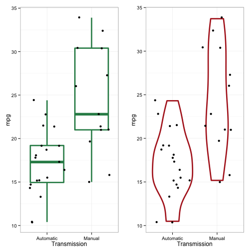
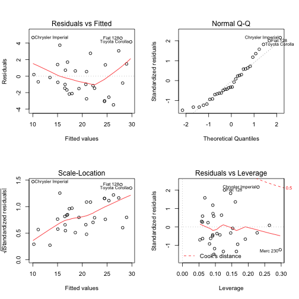

A brief investigation into miles per gallon efficiency of 32 cars by transmission type.

### Description

```r
mtcars <- mtcars
?mtcars
```
The data was extracted from the 1974 Motor Trend US magazine, and comprises fuel consumption and 10 aspects of automobile design and performance for 32 automobiles (1973–74 models).

### Format

A data frame with 32 observations on 11 variables.
`[, 1]  mpg     Miles/(US) gallon`

`[, 2]  cyl	    Number of cylinders`

`[, 3]	disp	Displacement (cu.in.)`

`[, 4]	hp	    Gross horsepower`

`[, 5]	drat	Rear axle ratio`

`[, 6]	wt	    Weight (lb/1000)`

`[, 7]	qsec	1/4 mile time`

`[, 8]	vs	    V/S`

`[, 9]	am	    Transmission (0 = automatic, 1 = manual)`

`[,10]	gear	Number of forward gears`

`[,11]	carb	Number of carburetors`


## Is an automatic or manual transmission better for MPG?


As we're focusing on the transmission type, we first want to re-label the `am` values to remove any ambiguity.

```r
mtcars$am[mtcars$am == 0] <- "Automatic"
mtcars$am[mtcars$am == 1] <- "Manual"
```

Next we take a quick look at the data to see what the shape of the data might tell us. 

We can clearly see from the plot in `fig.1` the manual transmission has a higher value spread of MPG compared to the automatic transmission. 


## Quantify the MPG difference between automatic and manual transmissions.
As there are a number of variables in the data set which might contribute to the MPG variances we can begin simply with a sole predictive transmission factor. `Fig.3`

We see that transmission alone cannot fully account for MPG. Intuitively we might infer that `weight` might play a role but and we can consider other significant factors. `Fig.4`


From `Fig.5` we see an r-squared value of 0.8499 which shows us that this model is responsible for 85% of the variance in `MPG`

```r
anova(am.model, qsec.model)
```

```
## Analysis of Variance Table
## 
## Model 1: mpg ~ factor(am)
## Model 2: mpg ~ wt + qsec + factor(am)
##   Res.Df    RSS Df Sum of Sq      F   Pr(>F)    
## 1     30 720.90                                 
## 2     28 169.29  2    551.61 45.618 1.55e-09 ***
## ---
## Signif. codes:  0 '***' 0.001 '**' 0.01 '*' 0.05 '.' 0.1 ' ' 1
```
With a p-value of `1.5e-09` we can deduce that this model significantly differs from our base model and can be used as a reasonable approximation of MPG influence. We can thus conclude from `summary(hp.model)` that an expected `2.936 MPG` can be attributed to a manual transmission over an automatic transmission. 

Finally we check the residuals with the plot in `Fig.3` for any signs of non-normality and find no discernible patterns which might not satisfy our assumptions.

## Appendix

##### Fig.1

```r
require(gridExtra)
library(ggplot2)
bg <- ggplot(mtcars, aes(factor(am), mpg)) + geom_boxplot(colour="seagreen", size = 1.25) + 
            geom_jitter() + theme_bw() + xlab("Transmission")
vg <- ggplot(mtcars, aes(factor(am), mpg)) + geom_violin(colour="firebrick", size = 1.25) +
            geom_jitter() + theme_bw() + xlab("Transmission")

grid.arrange(bg, vg, ncol=2)
```

 

##### Fig.2

```r
am.model <- lm(mpg ~ factor(am), data = mtcars)
summary(am.model)
```

```
## 
## Call:
## lm(formula = mpg ~ factor(am), data = mtcars)
## 
## Residuals:
##     Min      1Q  Median      3Q     Max 
## -9.3923 -3.0923 -0.2974  3.2439  9.5077 
## 
## Coefficients:
##                  Estimate Std. Error t value Pr(>|t|)    
## (Intercept)        17.147      1.125  15.247 1.13e-15 ***
## factor(am)Manual    7.245      1.764   4.106 0.000285 ***
## ---
## Signif. codes:  0 '***' 0.001 '**' 0.01 '*' 0.05 '.' 0.1 ' ' 1
## 
## Residual standard error: 4.902 on 30 degrees of freedom
## Multiple R-squared:  0.3598,	Adjusted R-squared:  0.3385 
## F-statistic: 16.86 on 1 and 30 DF,  p-value: 0.000285
```

##### Fig.3

```r
hp.model <- lm(mpg ~ wt + hp + factor(am), data = mtcars)
summary(hp.model)
```

```
## 
## Call:
## lm(formula = mpg ~ wt + hp + factor(am), data = mtcars)
## 
## Residuals:
##     Min      1Q  Median      3Q     Max 
## -3.4221 -1.7924 -0.3788  1.2249  5.5317 
## 
## Coefficients:
##                   Estimate Std. Error t value Pr(>|t|)    
## (Intercept)      34.002875   2.642659  12.867 2.82e-13 ***
## wt               -2.878575   0.904971  -3.181 0.003574 ** 
## hp               -0.037479   0.009605  -3.902 0.000546 ***
## factor(am)Manual  2.083710   1.376420   1.514 0.141268    
## ---
## Signif. codes:  0 '***' 0.001 '**' 0.01 '*' 0.05 '.' 0.1 ' ' 1
## 
## Residual standard error: 2.538 on 28 degrees of freedom
## Multiple R-squared:  0.8399,	Adjusted R-squared:  0.8227 
## F-statistic: 48.96 on 3 and 28 DF,  p-value: 2.908e-11
```

##### Fig.4

```r
qsec.model <- lm(mpg ~ wt + qsec + factor(am), data = mtcars)
summary(qsec.model)
```

```
## 
## Call:
## lm(formula = mpg ~ wt + qsec + factor(am), data = mtcars)
## 
## Residuals:
##     Min      1Q  Median      3Q     Max 
## -3.4811 -1.5555 -0.7257  1.4110  4.6610 
## 
## Coefficients:
##                  Estimate Std. Error t value Pr(>|t|)    
## (Intercept)        9.6178     6.9596   1.382 0.177915    
## wt                -3.9165     0.7112  -5.507 6.95e-06 ***
## qsec               1.2259     0.2887   4.247 0.000216 ***
## factor(am)Manual   2.9358     1.4109   2.081 0.046716 *  
## ---
## Signif. codes:  0 '***' 0.001 '**' 0.01 '*' 0.05 '.' 0.1 ' ' 1
## 
## Residual standard error: 2.459 on 28 degrees of freedom
## Multiple R-squared:  0.8497,	Adjusted R-squared:  0.8336 
## F-statistic: 52.75 on 3 and 28 DF,  p-value: 1.21e-11
```

##### Fig.5

```r
par(mfrow = c(2,2))
plot(qsec.model)
```

 


